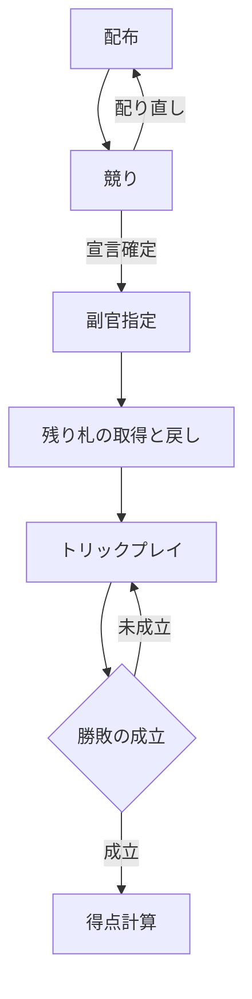

[English](./game-spec.md) | **日本語**

# ナポレオン ゲーム仕様書

## 1. 概要

ナポレオンは5人用のトリックテイキングゲームである。

競りで最も高い宣言をしたプレイヤーが**ナポレオン**となり、**副官**とともに**ナポレオン軍**を構成する。残りのプレイヤーは**連合軍**となる。

ナポレオン軍は宣言枚数以上の**絵札**の獲得を目指し、達成すれば**勝利**となる (絵札をすべて獲得すれば**完全勝利**)。

連合軍はそれを阻止する。阻止に成功すればナポレオン軍は**敗北**となる。

> [!NOTE]
> **トリックテイキング**とは、全員が1枚ずつカードを場に出し、最も強いカードを出したプレイヤーが場のカードを獲得するゲーム形式を指す。この1回分を**トリック**と呼ぶ。

---

## 2. 使用するカード

ジョーカー1枚を含む53枚のカードを使用する。

### 2-1. ランクとスート

- **ランク**: 2, 3, 4, 5, 6, 7, 8, 9, 10, J, Q, K, A の13段階。
- **スート**: クラブ、ダイヤ、ハート、スペードの4種類。

### 2-2. 絵札・数札・ジョーカー

カードは次の3種類に分けられ、絵札のみが得点対象となる。

| 種類 | 該当カード | 枚数 | 得点対象 |
|:---|:---|:---:|:---:|
| **絵札** | 10・J・Q・K・A (4スート × 5ランク) | 20 | ✓ |
| **数札** | 2〜9 (4スート × 8ランク) | 32 | ✗ |
| **ジョーカー** | — | 1 | ✗ |

> [!NOTE]
> 一般のトランプ用語では絵札は J・Q・K の3種類を指すことが多いが、本ゲームでは10と A も含む。

### 2-3. 切り札

競りで確定した宣言のスートを指す。切り札によってカードの強さが決まる ([§7-4](#7-4-カードの強さ))。

---

## 3. 特殊なカード

次のカードは特殊な強さや効果を持つ。うち4枚を**役札**と呼ぶ。役札はカードの強さで上位に位置し ([§7-4](#7-4-カードの強さ))、セイム ([§7-5](#7-5-セイム)) の成立を妨げる。

| 名称 | 該当カード | 役札 |
|:---|:---|:---:|
| **マイティ** | スペードA | ✓ |
| **ジョーカー** | ジョーカー | ✓ |
| **正ジャック** | 切り札のJ | ✓ |
| **裏ジャック** | 切り札と同色の別スートのJ | ✓ |
| **よろめき** | ハートQ | ✗ |
| **ジョーカー請求札** | クラブ3 | ✗ |

切り札と裏ジャックの対応は次のとおり。

| 切り札 | 裏ジャック |
|:---|:---|
| クラブ | スペードJ |
| ダイヤ | ハートJ |
| ハート | ダイヤJ |
| スペード | クラブJ |

各カードの強さは [§7-4](#7-4-カードの強さ) にまとめて示す。強さ以外の個別規則を持つカードを以下に挙げる。

### 3-1. ジョーカー

リード時はジョーカーを出した直後に任意のスートを指定し、それが台札スートとなる。フォロー時の扱いはマストフォロー ([§7-3](#7-3-マストフォロー)) を参照。

> [!NOTE]
> 第10トリックのリード時は、台札スートがフォロー時の選択に影響しないため、スート指定は不要である。

### 3-2. ジョーカー請求札

台札となった場合に限り、ジョーカーを請求する効果を持つ (請求の規則は [§7-3](#7-3-マストフォロー) を参照)。

---

## 4. プレイヤーと役割

プレイヤーは5人。各ゲームで次の役割を担う。

| 役割 | 人数 | 説明 |
|:---|:---:|:---|
| **ナポレオン** | 1 | 競りで最も高い宣言をしたプレイヤー |
| **副官** | 1 | 副官カード ([§6-3](#6-3-副官指定)) の所持者 |
| **連合軍** | 3 | ナポレオンと副官以外のプレイヤー |

ナポレオンと副官で**ナポレオン軍**を構成する。

> [!NOTE]
> **副官なし** ([§6-3](#6-3-副官指定)) となった場合は、ナポレオン軍は1人、連合軍は4人となり、得点計算も通常と異なる ([§6-7](#6-7-得点計算))。

---

## 5. ゲームの流れ

以下は1ゲームの流れである。ゲーム数は事前に決めても、決めずに続けてもよい。

---

## 6. フェーズ詳細

### 6-1. 配布

**ディーラー**は各プレイヤーに**10枚ずつ**配り、残った3枚 (**残り札**) を場の中央に裏向きで置く。

- 1ゲーム目のディーラーは任意の方法で決める。
- 2ゲーム目以降のディーラーは前ゲームの副官 (副官なしの場合はナポレオン) が務める。
- 配り直しとなった場合 ([§6-2](#6-2-競り)) は、現ディーラーの次のプレイヤー (時計回り) が務める。

### 6-2. 競り

ナポレオンを決めるフェーズである。

**進行**

1. ディーラーから時計回りに、各プレイヤーは**宣言**または**パス**を行う。一度パスしたプレイヤーも、後の手番で宣言できる。
2. 直近の宣言の後、他のプレイヤー全員 (4人) がパスしたとき、その宣言が確定して宣言者がナポレオンとなる。
3. 誰も宣言しないまま全員が2巡パスしたとき、**配り直し**を行う。

**宣言の形式**

宣言は**スート**と**枚数** (12〜20) の組み合わせとする。例: 「スペード16枚」。

**宣言の高さ**

宣言するには直近の宣言より高くなければならない (直近の宣言がない場合は除く)。「高い」とは次のいずれかを満たすことを指す。

1. **枚数が多い**
2. **枚数が同じで、スートが強い**

スートの強さは次のとおり。

**スペード** > **ハート** > **ダイヤ** > **クラブ**

例

| 直近の宣言 | 次の宣言 | 可否 |
|:---|:---|:---:|
| ハート12枚 | スペード12枚 | ✓ (スペード > ハート) |
| ハート12枚 | ダイヤ12枚 | ✗ (ダイヤ < ハート) |
| ハート12枚 | クラブ13枚 | ✓ (枚数が多い) |
| スペード20枚 | 任意の宣言 | ✗ (宣言の上限) |

### 6-3. 副官指定

ナポレオンは53枚の中から任意のカード1枚を**副官カード**として指定し、全員に告知する。副官カードの所持者が副官となる。

副官は自分が副官であることを明かしてはならない。副官カードがプレイされた時点、または勝敗が成立した時点で副官が判明する。

次のいずれかに該当する場合、ゲームは**副官なし**となる。

- ナポレオン自身が副官カードを所持している。
- 副官カードが残り札に含まれている。

### 6-4. 残り札の取得と戻し

1. ナポレオンは残り札の3枚を手札に加える。
2. 手札から3枚を選んで残り札に戻す。
   - **絵札**は**表向き**で戻し、第1トリックの勝者が獲得する ([§7-1](#7-1-第1トリック))。
   - **数札・ジョーカー**は**裏向き**で戻し、以降の進行には関与しない。

> [!NOTE]
> 副官カードが絵札のとき、それを残り札に戻すと、その時点で副官なしであることが全員に判明する。

### 6-5. トリックプレイ

最大10回のトリックを順に行う。詳細は [§7](#7-トリックプレイ詳細) を参照。

### 6-6. 勝敗の成立

宣言枚数を $B$、ナポレオン軍が獲得した絵札の枚数を $N$、連合軍が獲得した絵札の枚数を $A$ とする。ナポレオン軍の勝敗は次のいずれかとなる。

| 勝敗 | 成立条件 |
|:---|:---|
| **完全勝利** | $N = 20$ |
| **勝利** | $N \ge B$ かつ $A \ge 1$ |
| **敗北** | $A \ge 21 - B$ |

各トリック終了時、副官 (副官なしの場合はナポレオン) はいずれかの勝敗が成立していれば告知し、ゲームは終了する。第10トリック終了時には必ずいずれかの勝敗が成立する。

勝敗成立後、全プレイヤーは残った手札を公開する。

例: 宣言枚数 B = 16 の場合

- **完全勝利**: ナポレオン軍が絵札を20枚獲得。
- **勝利**: ナポレオン軍が絵札を16枚以上、連合軍が1枚以上獲得。
- **敗北**: 連合軍が絵札を5枚以上獲得 ($21 - 16 = 5$)。

### 6-7. 得点計算

ナポレオン軍の勝敗と役割に応じて、各プレイヤーの得点を増減する。全プレイヤーの得点合計は常に0となる。

**通常**

| 勝敗 | ナポレオン | 副官 | 連合軍 (各) |
|:---|:---:|:---:|:---:|
| 完全勝利 | **+12** | **+12** | -8 |
| 勝利 | **+6** | **+6** | -4 |
| 敗北 | -6 | -6 | **+4** |

**副官なし** ([§6-3](#6-3-副官指定))

| 勝敗 | ナポレオン | 連合軍 (各) |
|:---|:---:|:---:|
| 完全勝利 | **+24** | -6 |
| 勝利 | **+12** | -3 |
| 敗北 | -8 | **+2** |

---

## 7. トリックプレイ詳細

各トリックでは次の用語を用いる。

- **台札**: トリックの最初に出されるカード
- **リード**: 台札を出すプレイ
- **フォロー**: 台札に続いてカードを出すプレイ

各トリックは次のように進む。

1. リードするプレイヤーが台札を出す。
2. 残りのプレイヤーは時計回りに、マストフォロー ([§7-3](#7-3-マストフォロー)) に従って1枚ずつフォローする。
3. 全員が1枚ずつ出し終えたら、最も強いカード ([§7-4](#7-4-カードの強さ)) を出したプレイヤーが**トリックの勝者**となる。
4. 場のカードを次のとおり処理する。
   - **絵札**は勝者の前に**表向き**で並べ、ゲーム終了まで全員から見える状態を保つ。
   - **数札・ジョーカー**は**裏向き**にして場から除外し、以降の進行には関与しない。
5. 勝者が次のトリックをリードする。

### 7-1. 第1トリック

第1トリックは**ナポレオン**がリードし、次の特別ルールが適用される。

- 勝者はそのトリックで獲得した絵札に加え、[§6-4](#6-4-残り札の取得と戻し) で残り札に戻された絵札をすべて獲得する。
- セイム ([§7-5](#7-5-セイム)) は成立しない。

### 7-2. 台札スート

マストフォロー ([§7-3](#7-3-マストフォロー)) の基準となるスートを指す。台札の種類によって次のように決まる。

| 台札の種類 | 台札スート |
|:---|:---|
| ジョーカー以外のカード | そのカードのスート |
| ジョーカー | ジョーカーを出したプレイヤーが指定したスート ([§3-1](#3-1-ジョーカー)) |

### 7-3. マストフォロー

フォローするプレイヤーは、次の規則に従う (上から順に判定する)。

1. 台札がジョーカー請求札 ([§3-2](#3-2-ジョーカー請求札)) で、ジョーカー ([§3-1](#3-1-ジョーカー)) を持っていれば、ジョーカーを出さなければならない。
2. 台札スートのカードを持っていれば、台札スートのカードまたはジョーカーを出さなければならない。
3. それ以外は、任意のカードを出してよい。

### 7-4. カードの強さ

トリックの勝者は、次の優先度 (上にあるほど強い) で決まる。各カードの個別規則は [§3](#3-特殊なカード) を参照。

| 優先度 | カード | 内訳 |
|:---:|:---|:---|
| 1 | **よろめき** (マイティと同一トリックに出されている場合のみ) | — |
| 2 | **マイティ** | — |
| 3 | **ジョーカー** | — |
| 4 | **正ジャック** | — |
| 5 | **裏ジャック** | — |
| 6 | 切り札のカード (台札スートが切り札ではない場合のみ) | ランク順 (A最強) |
| 7 | 台札スートのカード | ランク順 (A最強)。セイム ([§7-5](#7-5-セイム)) 成立時はランク2が最強 |
| 8 | 上記以外 | トリックの勝敗に関与しない |

> [!NOTE]
> 優先度1 の条件を満たさないよろめきは、ハートQ として優先度6・7・8 のいずれかで扱う。
>
> 優先度6 の条件を満たさない切り札のカードは、優先度7 (台札スートのカード) で扱う。

台札スートが切り札ではないトリックで、出した時点で勝っている切り札のカード (優先度6) を**チェック**と呼ぶ。

### 7-5. セイム

次の条件をいずれも満たすトリックは**セイム**となる。ただし第1トリックでは成立しない ([§7-1](#7-1-第1トリック))。

1. 出されたカードがすべて同じスートである。
2. 役札 ([§3](#3-特殊なカード)) が1枚も出されていない。

セイム成立時、ランク2が最強となる (それ以外のランクの順序は通常どおり)。
