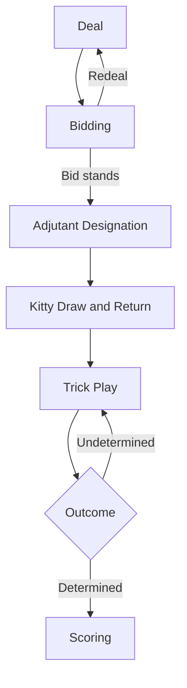

**English** | [日本語](./game-spec.ja.md)

# Napoleon Game Specification

## 1. Overview

Napoleon is a 5-player trick-taking game.

The highest bidder becomes **Napoleon** and, together with an **Adjutant**, forms **Napoleon's army**. The remaining players form the **Allied army**.

Napoleon's army aims to capture at least as many **honor cards** as the bid count, and **wins** if it succeeds (or achieves a **Perfect Win** if it captures every honor card).

The Allied army works to prevent this. If it succeeds, Napoleon's army **loses**.

> [!NOTE]
> **Trick-taking** is a game format in which every player plays one card per round, and whoever plays the strongest card captures the cards on the table. One such round is called a **trick**.

---

## 2. Cards Used

A 53-card deck is used: the standard 52 cards plus one Joker.

### 2-1. Ranks and Suits

- **Ranks**: 2, 3, 4, 5, 6, 7, 8, 9, 10, J, Q, K, A (13 ranks).
- **Suits**: Clubs, Diamonds, Hearts, Spades.

### 2-2. Honor Cards, Number Cards, and the Joker

Cards fall into the following three categories; only honor cards count for scoring.

| Category | Cards | Count | Scores |
|:---|:---|:---:|:---:|
| **Honor cards** | 10, J, Q, K, A (4 suits × 5 ranks) | 20 | ✓ |
| **Number cards** | 2 through 9 (4 suits × 8 ranks) | 32 | ✗ |
| **Joker** | — | 1 | ✗ |

> [!NOTE]
> In standard playing-card terminology, "face cards" usually refers to J, Q, and K only, but in this game honor cards also include 10 and A.

### 2-3. Trump

The trump is the suit of the winning bid. The trump determines card strength ([§7-4](#7-4-card-strength)).

---

## 3. Special Cards

The following cards have special strength or effects. Four of them are called **power cards**. They rank at the top of card strength ([§7-4](#7-4-card-strength)) and prevent Same ([§7-5](#7-5-same)) from taking effect.

| Name | Card | Power Card |
|:---|:---|:---:|
| **Mighty** | Spades A | ✓ |
| **Joker** | Joker | ✓ |
| **Right Bower** | The J of the trump suit | ✓ |
| **Left Bower** | The J of the same color as the trump but a different suit | ✓ |
| **Slip** | Hearts Q | ✗ |
| **Joker Call Card** | Clubs 3 | ✗ |

The Left Bower for each trump is as follows.

| Trump | Left Bower |
|:---|:---|
| Clubs | Spades J |
| Diamonds | Hearts J |
| Hearts | Diamonds J |
| Spades | Clubs J |

The strength of each card is consolidated in [§7-4](#7-4-card-strength). Cards with rules beyond strength are described below.

### 3-1. Joker

When the Joker is led, the player declares any suit immediately after playing it, and that suit becomes the lead suit. For its treatment when following, see the follow-suit rule ([§7-3](#7-3-follow-suit-rule)).

> [!NOTE]
> When leading on the 10th trick, the lead suit does not affect the choices when following, so no suit declaration is needed.

### 3-2. Joker Call Card

Only when it becomes the lead card does it have the effect of calling for the Joker (see [§7-3](#7-3-follow-suit-rule) for the call rule).

---

## 4. Players and Roles

There are 5 players. In each game, they take on the following roles.

| Role | Count | Description |
|:---|:---:|:---|
| **Napoleon** | 1 | The highest bidder |
| **Adjutant** | 1 | The holder of the adjutant card ([§6-3](#6-3-adjutant-designation)) |
| **Allied army** | 3 | All players other than Napoleon and the Adjutant |

Napoleon and the Adjutant together form **Napoleon's army**.

> [!NOTE]
> When the game is **solo** ([§6-3](#6-3-adjutant-designation)), Napoleon's army has 1 player and the Allied army has 4 players, and scoring also differs ([§6-7](#6-7-scoring)).

---

## 5. Game Flow

The diagram below describes a single game. The number of games may be set in advance, or play may continue indefinitely.

---

## 6. Phase Details

### 6-1. Deal

The **dealer** deals **10 cards** to each player and places the remaining 3 cards (the **kitty**) face-down in the center of the table.

- The dealer for game 1 is chosen by any method.
- From game 2 onward, the previous game's Adjutant is the dealer (Napoleon if the previous game was solo).
- On a redeal ([§6-2](#6-2-bidding)), the next player clockwise from the current dealer becomes the new dealer.

### 6-2. Bidding

The bidding phase determines who becomes Napoleon.

**Procedure**

1. Starting with the dealer and proceeding clockwise, each player makes a **bid** or **passes**. A player who has passed may still bid on a later turn.
2. As soon as the most recent bid is followed by passes from all four other players, that bid stands and its bidder becomes Napoleon.
3. If no bid is made and every player passes for two rounds in a row, a **redeal** is performed.

**Form of a Bid**

A bid is a combination of a **suit** and a **count** (12 to 20). Example: "Spades 16."

**Bid Hierarchy**

A bid must be higher than the most recent bid (this requirement does not apply when there is no recent bid). "Higher" means satisfying one of the following:

1. **Higher count**.
2. **Same count but stronger suit**.

Suit strength is as follows.

**Spades** > **Hearts** > **Diamonds** > **Clubs**

Examples

| Most recent bid | Next bid | Allowed |
|:---|:---|:---:|
| Hearts 12 | Spades 12 | ✓ (Spades > Hearts) |
| Hearts 12 | Diamonds 12 | ✗ (Diamonds < Hearts) |
| Hearts 12 | Clubs 13 | ✓ (Higher count) |
| Spades 20 | Any bid | ✗ (Already at the maximum) |

### 6-3. Adjutant Designation

Napoleon designates any single card from the 53-card deck as the **adjutant card** and announces it to all players. The holder of the adjutant card becomes the Adjutant.

The Adjutant must not reveal themselves. The Adjutant becomes known when the adjutant card is played, or when the outcome has been determined.

If either of the following holds, the game is **solo**:

- Napoleon holds the adjutant card themselves.
- The adjutant card lies in the kitty.

### 6-4. Kitty Draw and Return

1. Napoleon takes the 3 cards of the kitty into their hand.
2. Napoleon then chooses 3 cards from their hand and returns them to the kitty.
   - **Honor cards** are returned **face-up** and collected by the winner of the first trick ([§7-1](#7-1-first-trick)).
   - **Number cards and the Joker** are returned **face-down** and play no further part.

> [!NOTE]
> If the adjutant card is an honor card, returning it to the kitty reveals to all players that the game is solo.

### 6-5. Trick Play

Up to 10 tricks are played in sequence. See [§7](#7-trick-play-details) for details.

### 6-6. Outcome

Let $B$ be the bid count, $N$ the number of honor cards captured by Napoleon's army, and $A$ the number of honor cards captured by the Allied army. The outcome for Napoleon's army is one of the following:

| Outcome | Condition |
|:---|:---|
| **Perfect Win** | $N = 20$ |
| **Win** | $N \ge B$ and $A \ge 1$ |
| **Loss** | $A \ge 21 - B$ |

At the end of each trick, the Adjutant (Napoleon if solo) announces the outcome if it has been determined, and the game ends. By the end of trick 10, an outcome is always determined.

Once the outcome has been determined, all players reveal the cards remaining in their hands.

Example: bid count B = 16

- **Perfect Win**: Napoleon's army captures all 20 honor cards.
- **Win**: Napoleon's army captures 16 or more honor cards and the Allied army captures at least 1.
- **Loss**: The Allied army captures 5 or more honor cards ($21 - 16 = 5$).

### 6-7. Scoring

Points are added to or subtracted from each player's score based on the outcome for Napoleon's army and their role. The total of all players' scores is always 0.

**Standard**

| Outcome | Napoleon | Adjutant | Allied army (each) |
|:---|:---:|:---:|:---:|
| Perfect Win | **+12** | **+12** | -8 |
| Win | **+6** | **+6** | -4 |
| Loss | -6 | -6 | **+4** |

**Solo** ([§6-3](#6-3-adjutant-designation))

| Outcome | Napoleon | Allied army (each) |
|:---|:---:|:---:|
| Perfect Win | **+24** | -6 |
| Win | **+12** | -3 |
| Loss | -8 | **+2** |

---

## 7. Trick Play Details

The following terms apply to each trick.

- **Lead card**: the first card played in a trick
- **Leading**: the play of the lead card
- **Following**: the play of a card after the lead card

Each trick proceeds as follows.

1. The leader plays the lead card.
2. The other players follow in clockwise order, each playing one card under the follow-suit rule ([§7-3](#7-3-follow-suit-rule)).
3. Once all players have played, the player who played the strongest card ([§7-4](#7-4-card-strength)) becomes the **winner of the trick**.
4. The cards on the table are handled as follows:
   - **Honor cards** are placed **face-up** in front of the winner and remain visible to all until the end of the game.
   - **Number cards and the Joker** are turned **face-down** and set aside; they play no further part.
5. The winner leads the next trick.

### 7-1. First Trick

The first trick is led by **Napoleon**, and the following special rules apply:

- In addition to the honor cards captured in the trick, the winner takes every honor card returned to the kitty in [§6-4](#6-4-kitty-draw-and-return).
- Same ([§7-5](#7-5-same)) does not take effect.

### 7-2. Lead Suit

The lead suit is the reference suit for the follow-suit rule ([§7-3](#7-3-follow-suit-rule)). It is determined by the type of lead card:

| Type of lead card | Lead suit |
|:---|:---|
| Non-Joker card | The card's own suit |
| Joker | The suit declared by the player who played the Joker ([§3-1](#3-1-joker)) |

### 7-3. Follow-Suit Rule

Each following player obeys the rules below, evaluated in order from the top:

1. If the lead card is the Joker Call Card ([§3-2](#3-2-joker-call-card)) and the player holds the Joker ([§3-1](#3-1-joker)), they must play the Joker.
2. If the player holds at least one lead-suit card, they must play either a lead-suit card or the Joker.
3. Otherwise, they may play any card.

### 7-4. Card Strength

The winner of the trick is determined by the following priority (higher rows are stronger). For the individual rules of each card, see [§3](#3-special-cards).

| Priority | Card | Notes |
|:---:|:---|:---|
| 1 | **Slip** (only if the Mighty is played in the same trick) | — |
| 2 | **Mighty** | — |
| 3 | **Joker** | — |
| 4 | **Right Bower** | — |
| 5 | **Left Bower** | — |
| 6 | Trump-suit card (only when the lead suit is not the trump) | By rank (A strongest) |
| 7 | Lead-suit card | By rank (A strongest). Under Same ([§7-5](#7-5-same)), rank 2 is the strongest |
| 8 | Any other card | Does not affect the trick outcome |

> [!NOTE]
> A Slip that does not meet the condition for priority 1 is treated as the Hearts Q under priority 6, 7, or 8.
>
> A trump-suit card that does not meet the condition for priority 6 is treated under priority 7 (lead-suit card).

In a trick where the lead suit is not the trump, a trump-suit card (priority 6) that is the strongest card on the table at the moment it is played is called a **check**.

### 7-5. Same

A trick is a **Same** when both of the following conditions hold. However, Same does not take effect on the first trick ([§7-1](#7-1-first-trick)).

1. Every card played is of the same suit.
2. No power card ([§3](#3-special-cards)) is played.

When Same takes effect, rank 2 becomes the strongest (the order of the other ranks is unchanged).
