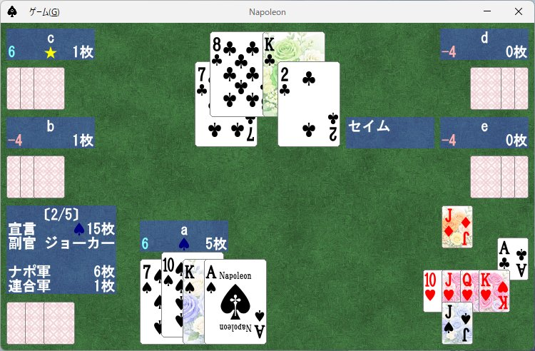

[English](./manual.md) | **日本語**

# 操作マニュアル

ナポレオン (5人用トリックテイキング) Swing アプリの操作説明。ゲームルールは [game-spec.ja.md](game-spec.ja.md) を参照。

## 1. 起動

| 方法 | コマンド |
|------|----------|
| 開発実行 | `./gradlew run` |
| Fat JAR ビルド | `./gradlew shadowJar` (`build/libs/napoleon-all.jar`) |
| Fat JAR 実行 | `Napoleon.vbs` をダブルクリック |

JDK 17 以上が必要。終了時に `napoleon.properties` (設定および通算成績) が保存される。例外発生時は `error.txt` に追記される。

## 2. 画面構成



- **下中央**: 自分 (プレイヤー a) の手札 (表向き)。
- **中左 / 上左 / 上右 / 中右**: 他プレイヤー (b / c / d / e) の手札 (裏向き)。
- **上中央**: 配布直後の残り札 (3枚)。
- **下左隅**: 戻し後の残り札。絵札は表向きで表示され、第1トリック終了時に勝者が獲得する。数札・ジョーカーは裏向きのままゲーム終了まで残る。
- **中央**: 現在のトリックで場に出ているカード。
- **下右**: 獲得済み絵札の一覧 (4スート × 5ランクのマス目)。
- **下左情報枠**: ゲーム番号、宣言 (スート + 枚数)、副官カード、ナポレオン軍 / 連合軍の絵札枚数。副官が未公開のうちは絵札枚数を範囲で表示する。
- **各プレイヤー脇の情報枠**: 名前 / 累計得点 (シアン、負なら淡赤) / 絵札獲得数。ナポレオンには切り札のスートアイコン、公開済みの副官には星マークが付く。
- **吹き出し**: 場面ごとに次の文言を表示する。
  - 競り: 「(スート) N枚」 / 「パス」
  - 配り直し: 「配り直し」
  - 副官指定: 「副官は…」(例: 「副官はマイティ」。副官カードを告知)
  - トリックプレイ: 「マイティ」「正ジャック」「裏ジャック」「ジョーカー」「よろめき」「チェック」「セイム」、ジョーカーをリードしたときに指定したスートを表す「(スート) 請求」、クラブ3 をリードしたときの「ジョーカー請求」
  - 結果: 「完全勝利！」「勝利！」「敗北…」

## 3. 「ゲーム」メニュー (Alt+G)

| 項目 | ショートカット | 動作 |
|------|:-:|------|
| 開始 | S | 新規セッションを開始 |
| タイトルに戻る | T | 進行中のゲームを破棄 (リプレイ中は終了) |
| リプレイ... | L | ログから1ゲームを再生 ([§6](#6-リプレイ)) |
| 成績表... | R | 通算成績を表示 ([§7](#7-成績表)) |
| 設定... | O | 設定ダイアログを開く ([§5](#5-設定)) |
| 終了 | X | アプリを終了 |

## 4. プレイ操作

### 4-1. 共通

待ち時間が `0` のときは、各演出後に**画面クリックまたは任意キー**で次に進める。`> 0` のときは自動で進む。

### 4-2. 競り

縦並びのボタンダイアログで「パス」または「(スート) N枚」を選ぶ。直近の宣言以下のボタン、および最大宣言 (スペード20枚) を超えるボタンは無効化される。

- ↑↓ ←→: 有効ボタン間を巡回
- Enter / Space: 確定
- ✕ で閉じる: パス扱い

### 4-3. 副官指定

ラジオボタンで指定する。

- **ジョーカー / マイティ / 正ジャック / 裏ジャック**: ワンクリックで選択
- **その他**: スートとランク (10はT表記) をプルダウンから指定
- Enter または OK で確定

### 4-4. 残り札の取得と戻し

ナポレオンは残り札3枚を手札に加え (13枚になる)、その中から3枚を残り札に戻す。

- マウスホバー / ←→: カードを選択
- 左クリック / Space / Enter / ↓: 選択中のカードを戻し候補に追加 (浮き上がる)。3枚選び終えると確定する
- 浮き上がったカードをもう一度クリック: 解除
- 右クリック / ↑: すべての選択を解除し、手札を昇順にソート

### 4-5. トリックプレイ

- マウスホバー / ←→: マストフォローに従って出せるカードのみ選択できる
- 左クリック / Space / Enter / ↓: 確定
- **ジョーカーをリードしたとき**: 続けてスート指定ダイアログが開く (最終トリックを除く)

## 5. 設定

| 項目 | 既定 | 説明 |
|------|:----:|------|
| ゲーム数 | 5 | 1セッションあたりのゲーム数。0 で無制限 |
| 待ち時間 | 600 | 演出 1 ステップのミリ秒数。0 で手動進行 |
| 自動プレイ | OFF | 自分 (プレイヤー a) も COM が操作する |
| 最終トリックまで続行 | OFF | 勝敗確定後も第10トリックまで進める |
| ゲームログ | ON | `log/napoleon.txt` にゲーム記録を追記する |

## 6. リプレイ

ログから1ゲームを選んで再生する機能。

1. メニュー「リプレイ...」→ ログファイル (既定: `log/napoleon.txt`) を選択。
2. ゲーム一覧から1ゲーム選ぶ。
3. 設定の待ち時間にかかわらず手動進行となる。各演出後に**画面クリックまたは任意キー**で次に進める。
4. ゲーム終了またはメニュー「タイトルに戻る」で終了する。

## 7. 成績表

**通常 / 副官なし × 完全勝利 / 勝利 / 敗北** の6パターンを役割ごとに集計する。

- **行 (6)**: 通常 完全勝利 / 勝利 / 敗北、副官なし 完全勝利 / 勝利 / 敗北
- **列 (3)**: ナポレオン / 副官 / 連合軍 (副官なしの行では副官列は「-」)

**通算** (メニュー → 成績表) では平均得点を、**セッション終了時**は今回得点と順位を表示する。

## 8. ファイル

| パス | 用途 |
|------|------|
| `napoleon.properties` | 設定および通算成績 (起動時読み込み・終了時保存) |
| `log/napoleon.txt` | ゲームログ (「ゲームログ」ON 時に追記、形式は [§9](#9-ログ形式)) |
| `error.txt` | 例外スタックトレース |

## 9. ログ形式

`log/napoleon.txt` は固定幅テキストで、人間にも読める。1ゲームが次のブロック構造で追記される。

```
=== 2026-01-01 12:34:56          タイムスタンプ
 a   b   c   d   e               プレイヤー (席順)
D12 H12  -   -  S12              競り (各列はプレイヤーに対応、5列で折り返し)
D13  -   -   -  S13              「Sn」=スペードで n 枚宣言、「-」=パス
...
---
D17 @A                           確定した宣言 + 副官カード
CJ DT C9 -> CJ H7 HT             取得した残り札 → 戻した3枚
---
a:NP  b:AL  c:AL  d:AL  e:AD | a:NP  b:AL  c:AL  d:AL  e:AD
[+J]   D6    D8    D4    D2  |  3(3)  0     0     0     0
 DT    SQ    ST    S4   [S3] |  6(3)  0     0     0     3
                                 ヘッダ行: 役割 (NP=ナポレオン / AD=副官 / AL=連合軍)
                                 「|」の左 (各列はプレイヤーに対応): 出されたカード ([] がリード)
                                 「|」の右: 累計絵札数 ((n) は当トリックの獲得枚数)
...
---                              (最終トリックまで進めず終わった場合のみ)
 C8    D2    DK    DA    D6      未プレイの残り手札
 S6    CQ    CA    H8    D7
---
 +6    -4    -4    -4    +6      プレイヤーごとの得失点
```

### カード表記

| 記号 | 意味 |
|------|------|
| `Sx` `Hx` `Dx` `Cx` | スート + ランク (`2`〜`9`, `T`, `J`, `Q`, `K`, `A`) |
| `@A` | マイティ (スペードA) |
| `**` | ジョーカー |
| `S*` `H*` `D*` `C*` | リードで出されたジョーカー + 指定スート |
| `+J` | 正ジャック (切り札のJ) |
| `-J` | 裏ジャック (切り札と同色の別スートのJ) |
| `@Q` | よろめき (ハートQ)。マイティと同一トリックに出されたときのみこの表記 |
